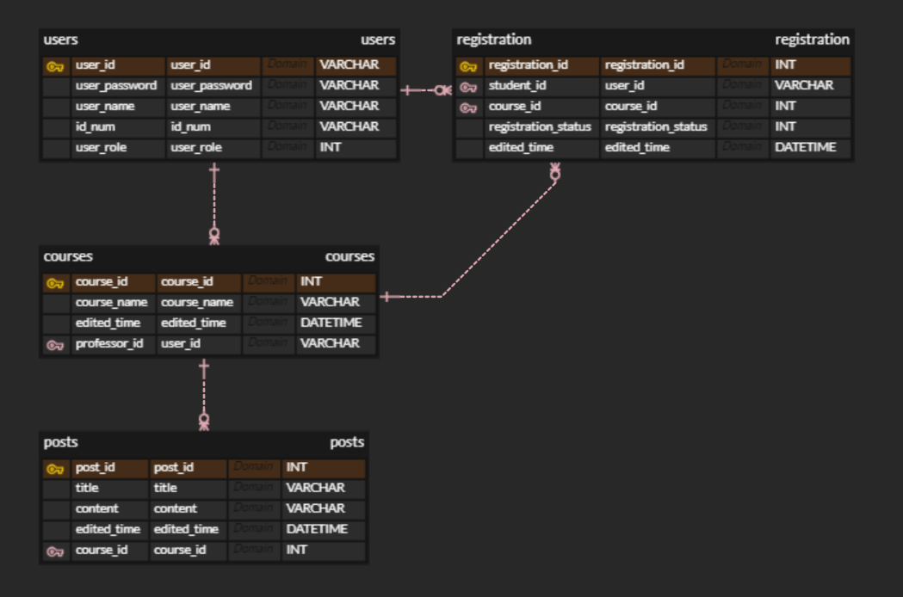

# K-COURSE

간단한 온라인 교육 플랫폼 (2023 KWEB 정회원 면제 과제)

### 로그인 페이지


### 회원가입 페이지


### 홈 페이지

- 교수자.ver

  

- 학생.ver

  

## 주요 기능

> ### 공통

[1] 회원가입

아이디, 비밀번호, 이름, 학번, 학생/교수자 여부를 입력하여 회원가입합니다.

    1. 로그인 페이지 하단 "회원가입" 클릭
    2. 사용자 정보 입력
    3. 완료 버튼 클릭

[2] 로그인

아이디, 비밀번호를 입력하여 로그인합니다.

    1. 로그인 페이지 입력창에 아이디, 비밀번호 입력
    2. 로그인 버튼 클릭

[3] 로그아웃

로그인 된 상태에서 로그아웃 합니다.

    1. 홈 페이지 우측 상단 로그아웃 버튼 클릭

> ### 교수자

[1] 개설한 강의 조회

교수자 사용자가 개설한 강의를 조회합니다.
홈 페이지에서 조회할 수 있습니다.
[2] 강의 개설

새로운 강의를 개설합니다.

    1. 홈 페이지 좌측 영역 상단의 "강의 개설" 버튼을 클릭합니다.
    2. 하단에 표시되는 강의 개설 창에 강의 제목을 입력합니다.
    3. "추가" 버튼을 클릭합니다.

[3] 강의 삭제

개설한 교수자 자신의 강의를 삭제합니다.

    1. 홈 페이지 좌측 영역의 강의 목록을 조회합니다.
    2. 강의 목록의 우측 "강의 삭제" 버튼을 클릭합니다.

[4] 강의 게시글 조회

강의 별 작성한 게시글을 조회합니다.

    1. 홈 페이지 좌측 영역의 강의 목록을 조회합니다.
    2. 강의 목록을 클릭합니다.
    3. 우측 영역에 해당 강의의 게시글을 조회할 수 있습니다.

[5] 강의 게시글 추가

선택한 강의에 새로운 게시글을 추가합니다.

    1. 홈 페이지 좌측 영역의 강의 목록을 조회합니다.
    2. 강의 목록을 클릭합니다.
    3. 우측 영역 상단의 "새 게시글 작성" 버튼을 클릭합니다.
    4. 하단에 표시되는 창에 제목, 내용을 작성합니다.
    5. "추가" 버튼을 클릭합니다.

[6] 강의 게시글 삭제

선택한 강의 게시글을 삭제합니다.

    1. 홈 페이지 좌측 영역의 강의 목록을 조회합니다.
    2. 강의 목록을 클릭합니다.
    3. 우측 영역 게시글 목록의 "삭제" 버튼을 클릭합니다.

[7] 수강 인원 삭제

강의에서 선택한 학생을 수강 취소합니다.

    1. 홈 페이지 좌측 영역의 강의 목록을 조회합니다.
    2. 강의 목록을 클릭합니다.
    3. 우측 영역 우측 상단의 "수강인원" 탭을 클릭합니다.
    4. 학생 목록의 우측 "삭제" 버튼을 클릭합니다.

> ### 학생

[1] 수강 중인 강의 조회

학생이 수강 신청한 강의 목록을 조회합니다.

    홈 페이지 좌측 영역에서 확인할 수 있습니다.

[2] 수강 취소

학생이 수강 신청한 강의를 수강 취소합니다.

    홈 페이지 좌측 영역의 강의 목록 우측 "수강 취소" 버튼을 클릭합니다.

[3] 수강 신청

신청하지 않은 강의들 중에서 수강 신청 합니다.

    1. 홈 페이지 좌측 영역 상단 "수강신청" 탭을 클릭합니다.
    2. 강의 목록 우측 "수강 신청" 버튼을 클릭합니다.

[4] 수강 중인 강의의 게시글 조회

수강 신청한 강의의 게시글을 조회합니다.

    1. 홈 페이지 좌측 영역의 강의 목록을 클릭합니다.
    2. 우측 영역에서 게시글 목록을 조회할 수 있습니다.

[5] 최근 게시글 조회

수강 중인 강의들의 게시글을 시간 순으로 모두 조회합니다.

    1. 홈 페이지 좌측 영역의 강의 목록에서 "최근 게시글"을 클릭합니다.
    2. 우측 영역에서 최근 게시글 목록을 조회할 수 있습니다.

## 설치 및 실행

프로젝트를 로컬 환경에서 설치하고 실행하는 방법에 대한 안내

### **설치**

```bash
git clone https://github.com/wonsun2006/k-course.git
cd ./k_course/frontend
npm install
cd ../backend
npm install
cd ../
```

### **MySQL DB 생성**

MySQL에 K-Course 관련 테이블을 생성합니다.

```bash
mysql -u 사용자이름 -p <> ./k_course/backend/sql/initial_db.sql
```

### **환경변수 설정 (.env 파일)**

./frontend/.env

    REACT_APP_API_HOST=http://localhost:8080

./backend/.env

    SERVER_PORT=8080
    DB_HOST=localhost
    DB_USER=MySQL사용자이름
    DB_PASSWORD=MySQL사용자비밀번호
    DB_NAME=k_course_db
    SESSION_SECRET=세션비밀키(랜덤키)

### **실행**

- 프론트엔드 실행

  ```bash
  cd frontend
  npm start
  ```

- 백엔드 실행
  ```bash
  cd backend
  npm run dev
  ```

## 관련 문서

### ERD

https://www.erdcloud.com/d/v847eEt2G4AxXkD8D



### API 명세서

https://documenter.getpostman.com/view/9404716/2s9YC1XEh2
